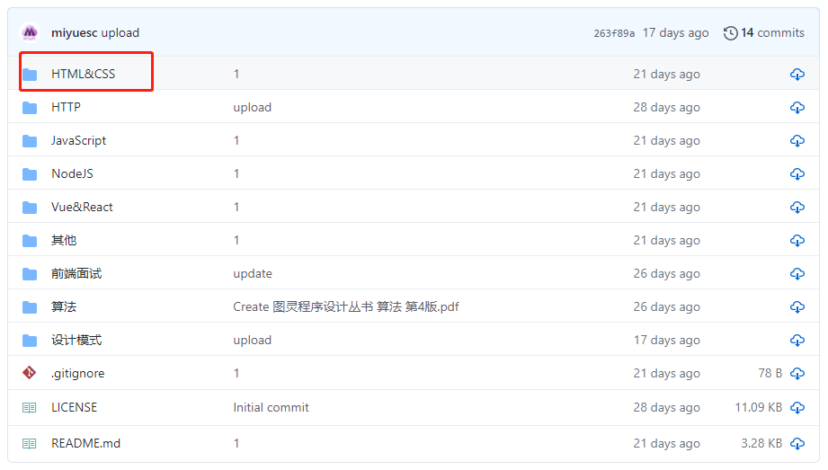
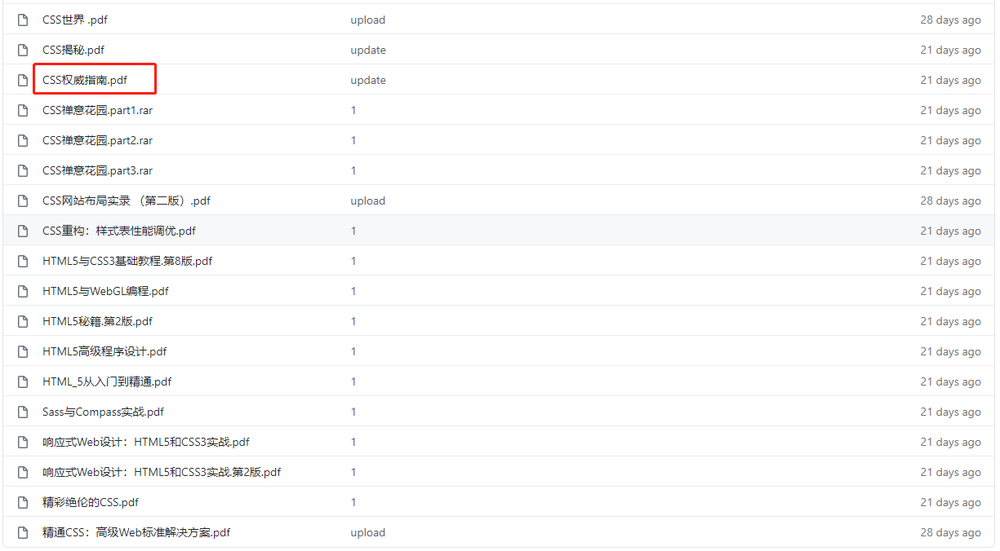
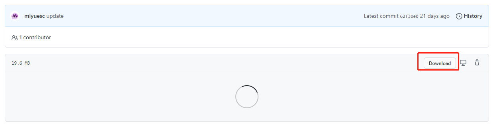

# documents

---

> 所有书籍仅用于个人查阅，请勿用于商业用途。
> 收集的程序开发相关的书籍与文档，多数为 PDF 格式文件，欢迎 fork 和 star。

---

## 文件分类

> 部分文件可能存在内容过时或者错误的情况，如有问题请提 issue。

### 1. 设计模式

1. JavaScript 设计模式 —— 张容铭
2. JavaScript 设计模式与开发实践

### 2. 算法

1. 算法图解
2. 经典算法大全
3. 学习JavaScript数据结构与算法（第3版）
4. 图灵设计丛书 算法（第4版）

### 3. JavaScript

1. Head First JavaScript程序设计.pdf
2. JavaScript Promise迷你书(中文版).pdf
3. JavaScript Web应用开发.pdf
4. JavaScript函数式编程.pdf
5. JavaScript基础教程.第9版.pdf
6. JavaScript快速全栈开发.pdf
7. JavaScript权威指南(第6版).pdf
8. JavaScript编程全解.pdf
9. JavaScript编程精粹.pdf
10. JavaScript语言精粹（修订版）.pdf
11. JavaScript高级程序设计（第4版）.pdf
12. 你不知道的JavaScript(上卷).pdf
13. 你不知道的JavaScript(下卷).pdf
14. 你不知道的JavaScript(中卷).pdf
15. 数据结构与算法：JavaScript描述.pdf
16. 高性能JavaScript编程.pdf

### 4. HTML & CSS

1. CSS世界 .pd
2. CSS揭秘.pdf
3. CSS权威指南.pdf
4. CSS禅意花园.pdf
5. CSS网站布局实录 （第二版）.pdf
6. CSS重构：样式表性能调优.pdf
7. HTML5与CSS3基础教程.第8版.pdf
8. HTML5与WebGL编程.pdf
9. HTML5秘籍.第2版.pdf
10. HTML5高级程序设计.pdf
11. HTML_5从入门到精通.pdf
12. Sass与Compass实战.pdf
13. 响应式Web设计：HTML5和CSS3实战.pdf
14. 响应式Web设计：HTML5和CSS3实战.第2版.pdf
15. 精彩绝伦的CSS.pdf
16. 精通CSS：高级Web标准解决方案.pdf

### 5. NodeJS

1. Node.js实战.pdf
2. Node.js实战.第2版.pdf
3. Node.js实战心得.pdf
4. Node.js开发指南.pdf
5. Node与Express开发.pdf
6. Node即学即用.pdf
7. 七天学会 Nodejs.pdf
8. 深入浅出Node.js.pdf
9. node官方中文文档

### 6. HTTP

1. HTTP 权威指南
2. TCP-IP 协议详解 卷1
3. 图解 HTTP（彩色版）
4. 网络是怎么连接的

### 7. Vue & React
1. React Native入门与实战.pdf
2. React Native应用开发实例解析.pdf
3. React Native开发指南.pdf
4. React快速上手开发.pdf
5. React设计模式与最佳实践.pdf
6. Vue.js权威指南（扫描版）.pdf
7. 深入React技术栈.pdf

### 8. 面试

1. 80%应聘者都不及格的JS面试题
2. 前端面试题汇总

### 9. 其他

1. AngularJS权威教程.pdf
2. C数据结构.pdf
3. Docker —— 从入门到实践 - v1.0.pdf
4. Docker 中文教程 - v1.0.pdf
5. Go语言编程.pdf
6. Linux 命令行 - v1.0.pdf
7. Mongodb 教程 - v1.0.pdf
8. Nginx 入门指南 - v1.0.pdf
9. Redis 3.0 中文版 - v1.1.pdf
10. Shell 十三问 - v1.1.pdf
11. Shell 教程 - v1.0.pdf
12. ubuntu14.04安装gitlab.pdf
13. WebKit技术内幕.pdf
14. [图灵程序设计丛书].Web安全开发指南.pdf
15. [图灵程序设计丛书].Web开发权威指南.pdf
16. [图灵程序设计丛书].Web性能权威指南.pdf
17. [图灵程序设计丛书].函数式编程思维.pdf
18. [图灵程序设计丛书].前端架构设计.pdf
19. 七大查找算法及C++源码.pdf
20. 同构JavaScript应用开发.pdf
21. 最全解决遍历树的问题.pdf
22. 鸟哥的Linux私房菜 基础学习篇(第三版).pdf

### 附：下载说明

由于大部分文件都比较大，如果整个仓库下载的话可能会十分缓慢或者下载不成功。所以建议各位单独下载某个需要的文件，看完之后再下载下一部分。

例如我要下载 “CSS权威指南”

直接进入文件，基本上会处于加载状态，并且会无法加载。这时直接点击右上角的 `Download` 就可以下载该文件了。